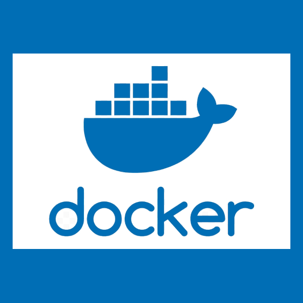
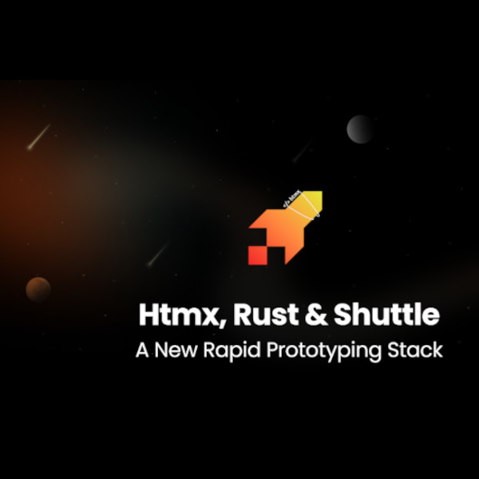

<main>

# <a href="../index.html">⇦ home</a> {.collapse}

# Demo

<section id="section-rust">
<header>
## Rust

Rust for the Web

</header>
<aside>
<h3 style="padding-left:1em; border: 2px solid var(--color-bg-secondary); border-radius: 4px;">Wasm</h3>

Wasm is designed as a portable compilation target for programming languages, enabling deployment on the web for client and server applications.

</aside>
<aside>
<h3 style="padding-left:1em; border: 2px solid var(--color-bg-secondary); border-radius: 4px;">Axum</h3>

AXUM is a web application framework that focuses on ergonomics and modularity.

</aside>
<aside>
<h3 style="padding-left:1em; border: 2px solid var(--color-bg-secondary); border-radius: 4px;">Dioxus</h3>

 Dioxus is a Rust library for building apps that run on desktop, web, mobile, and more.

</aside>
</section>

<section id="section-frontend">
<header>
## Frontend coding

Simple. Lightweight. Powerful.

</header>

Alpine and webassembly helps us create interactive web applications with minimal code.
This simplifies the cooperation between the developers and the designers freeing valuable time to actually build stuff.

<aside>
<h3 style="padding-left:1em; border: 2px solid var(--color-bg-secondary); border-radius: 4px;">Rapid Prototype</h3>

Interactive front-end interfaces, using Alpine.js. For server rendered, static or pre-rendered sites.

<small>Test your Ideas</small>

</aside>
<aside>
<h3 style="padding-left:1em; border: 2px solid var(--color-bg-secondary); border-radius: 4px;">CSS Animations</h3> <!-- https://coolcssanimation.com/ -->

Client side Animations

</aside>
<aside>
<h3 style="padding-left:1em; border: 2px solid var(--color-bg-secondary); border-radius: 4px;">SVG </h3>

Powerful Animations

</aside>
</section>

<section id="section-backend">
<header>
## Backend devOps

Section Subheading

</header>
<aside>
<h3 style="padding-left:1em; border: 2px solid var(--color-bg-secondary); border-radius: 4px;">Docker</h3>

Docker can package an application and its dependencies in a virtual container that can run on any Linux, Windows, or macOS computer.

</aside>
<aside>
<h3 style="padding-left:1em; border: 2px solid var(--color-bg-secondary); border-radius: 4px;">Shuttle</h3>

Shuttle is a Rust-native cloud development platform that lets you deploy your app while also taking care of all of your infrastructure.

</aside>
<aside>
<h3 style="padding-left:1em; border: 2px solid var(--color-bg-secondary); border-radius: 4px;">Database</h3>

The Rust SQL Toolkit is an async, pure Rust SQL crate featuring compile-time checked queries with supports for PostgreSQL, MySQL, and SQLite.

</aside>
</section>

---

# Game developement

<section id="section-games">
<header>
## Html5 Canvas & Wasm

Games in the browser

</header>
<aside>
<h3>Invaders</h3>

Card content*

<small>*with small content</small>

</aside>
<aside>
<h3>Hero</h3>

Card content with notification

</aside>
<aside>
<h3>Rogue</h3>

Card content

</aside>
<aside>
<h3>Platform2D</h3>

Card content

</aside>
</section>

---

<section id="section-demo_games">
## Demo and tutorials

 

<blockquote>
"Constraints Are an Essential Aspect of Game Development"
<footer><i>- [David Arcila](https://gamedevelopment.tutsplus.com/constraints-are-an-essential-aspect-of-game-development--gamedev-1448a)</i></footer>
</blockquote>

| Demo   | Description                 |
|:------:|-----------------------------|
| [Invaders](./invaders/index.html)    | invader with a twist | 
| [Snake Game](./)| |
| [Game of Life revisited](./)| |
| | |

</section>

<!--

<article>
<h2>Left-aligned header</h2>

Left-aligned paragraph

<aside>

Article callout

</aside>
<ul>
<li>List item 1</li>
<li>List item 2</li>
</ul>

 
<figure>

<figcaption><i>Image caption</i></figcaption>
</figure>

<article>
</main>

{style="width:100%;height:20rem;"}

<main>

Expandable title

Revealed content

Another expandable title

More revealed content

 

Inline <code>code</code> snippets

<pre>
<code>
// preformatted code block
</code>
</pre>

-->

[Top](#TOC)

</main>
<header>
<footer>
  <a href="https://github.com/lerina" target="_blank" title="github">{.link .glow}
  </a>
</footer>
</header>
