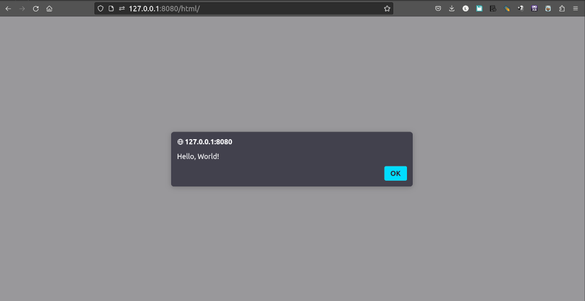

<div class="navbar"><a class="openbtn" onclick="openNav()">&#9776;</a></div>

<div class="prevnext"><span class="button left">[<-- list of examples ](./index.html#list) </span>
<span class="button right">[console.log -->](./002_console_log.html) </span></div>

<main>

*This is the "Hello, world!" example of #[wasm_bindgen] showing how to set up a project, export a function to JS, call it from JS, and then call the alert function in Rust.*  
_ [wasm-bindgen Guide](https://rustwasm.github.io/wasm-bindgen/examples/hello-world.html){target="_blank"}

[wasm-bindgen example](https://rustwasm.github.io/wasm-bindgen/examples/hello-world.html){target="_blank"}


> PART I. Make it run

##### 1. Set up your file structure

```sh
cargo new hello_world --lib
cd hello_world
mkdir -p www/html www/js
```

You should have this file structure

```sh
.
├── Cargo.toml
├── src
│   └── lib.rs
└── www
    ├── html
    └── js
```


##### 2. Edit Cargo.toml: Set the crate-type and add wasm-bindgen as a dependency.

In Cargo.toml, put `crate-type = ["cdylib"]` after `edition` entry.
And add wasm-bindgen as a dependency.

```toml
[package]
name = "hello_world"
version = "0.1.0"
edition = "2021"

[lib]
crate-type = ["cdylib"]

# See more keys and their definitions at https://doc.rust-lang.org/cargo/reference/manifest.html

[dependencies]
wasm-bindgen = "0.2.88"
```

Note: 

`wasm-bindgen-cli` will be installed 
when we build with wasm-pack the first time, 
so we are all good to go.

##### 3. Get the lib.rs code for hello_world

We'll cut and paste and modify the examples. 
The point is to get used to convert code meant to be deployed 
with NPM-Webpack ecosystem into a play vanilla no-bundle Rust wasm code.

```rust
// src/lib.rs
use wasm_bindgen::prelude::*;

#[wasm_bindgen]
extern "C" {
    fn alert(s: &str);
}

#[wasm_bindgen]
pub fn greet(name: &str) {
    alert(&format!("Hello, {}!", name));
}
```

##### 4. Specify type module in index.html

Here is the first difference.


Our index file at `www/html/index.html` look like this:

```html
<!DOCTYPE html>
<html>
<head>
  <meta charset="UTF-8">
  <title>Wasm no NPM no Webpack</title>
  <link rel="stylesheet" href="../css/styles.css">
</head>
<body>


  <script type="module" src="../js/index.js"></script>
</body>
</html>
```

Note the `type="module"` 

##### 5. import with file extension included and Wrap the code in async/await index.js

Second difference.

Our full index.js is modified to look like this:

```javascript
import init, { greet } from "../pkg/hello_world.js";

async function run() {
    const wasm = await init();

    greet('World');
}

run();
```


##### 6. build with wasm-pack

```sh
wasm-pack build --target web --no-typescript --out-dir www/pkg
```


- ` --target web` to specify nobundle
- `--no-typescript` we are not using TypeScript for these examples
- `--out-dir www/pkg` by default `pkg` is the same level as `src` directory.
Its cleaner to have all our web stuff in `www`.

wasm-pack through wasm-bindgen-cli will generate the following in our `pkg` directory.

```
└── pkg
    ├── hello_world_bg.wasm   # Wasm bytecode
    ├── hello_world.js        # JavaScript module to import (ESM)
    └── package.json
```


The output of `--target web` is included as an ES module.
Thats why we endup with an ES6 flavor of JavaScript.

##### 7. Run the web server and open your browser

You can use any file server, or follow along with `http` which we installed after wasm-pack.

You can host locally the `www` directory with `http www`.
It defaults at  http://127.0.0.1:8000

You can pass the address and port number like this:

```sh
http -a 127.0.0.1 -p 8080 www
```

Specifying our directory `www` will expose the following file structure to our server

```
www
├── html
│   └── index.html
├── js
│   └── index.js
└── pkg
    ├── hello_world_bg.wasm
    ├── hello_world.js        
    └── package.json
```

Open `index.html` in a browser by pointing at [http://127.0.0.1:8080/html/]



---

> PART II. Understand the Code

The following is heavily indebted to MDN's [Compiling from Rust to WebAssembly](https://developer.mozilla.org/en-US/docs/WebAssembly/Rust_to_Wasm){target="_blank"}

<!--
For more details have a look at
[wasm-bindgen — how does it work?!](https://fitzgen.github.io/wasm-cg-wasm-bindgen/#1) by Nick Fitzgerald
-->
## Using wasm-bindgen to communicate between Rust and JavaScript

### The lib.rs file

`wasm-pack` uses `wasm-bindgen`, to provide a bridge between the types of JavaScript and Rust. 
It allows JavaScript to call a Rust API with a string, or a Rust function to catch a JavaScript exception.

"The src/lib.rs file is the root of the Rust crate that we are compiling to WebAssembly. It uses wasm-bindgen to interface with JavaScript. 

In this example, it imports the window.alert JavaScript function, 
and exports the greet Rust function, which alerts a greeting message."

<!--
[rustwasm book:](https://rustwasm.github.io/docs/book/game-of-life/hello-world.html#wasm-game-of-lifesrclibrs){target="_blank"}
-->

- `extern` tells Rust that we want to call some externally defined functions. 
- `#[wasm-bindgen]` on top of it knows how to find these functions for us in JavaScript.
in this case it will glue window.alert() from the browser's JavaScript to the Rust function header
that provides us a function signature Rust can understand.

<!--

[source](https://stackoverflow.com/questions/70437614/how-does-wasm-bindgen-determine-which-bindings-to-generate){target="_blank"}
In a nutshell, the #[wasm_bindgen] macro generates executable functions that describe the necessary bindings in Javascript inside some_binary.wasm. These functions are then executed by the wasm-bindgen CLI program to generate the Javascript bindings and a stripped WebAssembly module, i.e., some_binary_bg.wasm.
-->

Whenever you want to call JavaScript functions, 
you can add them to this file in this manner, 
and wasm-bindgen takes care of setting everything up for you.


```rust
// src/lib.rs
// To crate to communicate between Rust and JavaScript
use wasm_bindgen::prelude::*;


// Calling external functions in JavaScript from Rust
#[wasm_bindgen]
extern "C" {
    fn alert(s: &str);
}

// Producing Rust functions that JavaScript can call 
#[wasm_bindgen]
pub fn greet(name: &str) {
    alert(&format!("Hello, {}!", name)); //call alert function we asked for in the extern block above
}
```

To expose public Rust function to the browsers' runtime  and allow calls from JavaScript,
use the  `#[wasm_bindgen]` attribute by placing it over the  `pub fn` block.

```rust
// Producing Rust functions that JavaScript can call 
#[wasm_bindgen]
pub fn greet(name: &str) {
...
```
 
It's the opposite of extern.

This function is named greet, and takes one argument, a string (written &str), name. 
It then calls the alert function we asked for in the extern block above.

We use the `format!` macro to concatenate two string-literal and convert in to a String slices `&`


So the `alert` in `greet` calls the `alert` in the `extern` block, 
which is glued to `window.alert` in the browser runtime.


For the curious, have a look at 
[Design of wasm-bindgen](https://rustwasm.github.io/wasm-bindgen/contributing/design/index.html){target="_blank"}


## index.html and index.js files

1. index.html

`import` declarations in JavaScript can only be present in modules, so our `html` must specify that our `index.js`
file is a module.

`<script type="module" src="../js/index.js"></script>`

2. index.js

<!-- 
You may still come across unhelpful old information for our purpose. Information such as

```
// Note that a dynamic `import` statement here is required due to
// webpack/webpack#6615, but in theory `import { greet } from './pkg';`
// will work here one day as well!
const rust = import('./pkg');

rust
  .then(m => m.greet('World!'))
  .catch(console.error);
```

We are starting to see examples of the "modern" version 
of doing things but its still bundle specific like this: 

```JavaScript
import { greet } from './pkg';

greet('World');
```
-->

To specify that we are not using NPM and a bundler, 
we used `wasm-pack --target web --no-typescript --out-dir www` to compile our code.
We are not using typescript for our examples so `--no-typescript` will
prevent the production of `*.ts` files in `pkg`.

Without NPM, the build will produce ES6 code in `www/pkg`. 
Hence we used `ES module` import syntax.
Not how unlike the official documentation we must 
as a result specify the filename with its extension `.js` in our `import` statement:

`import ... from "../pkg/hello_world.js";`

Where did this `hello_world` from?  
`wasm-pack` gets the name from our crate name as specified in Cargo.toml

```toml
[package]
name = "hello_world"
...
```

and produces its JavaScript glue code with the same name.

There is an initialization function `init` which
will "boot" the module and make it ready to use.

We must import this provided default `init` function. 

`import init, ... from "../pkg/hello_world.js";`

The init() function will load the  `.wasm` binary that is in `www/pkg`

Next we import the `greet` function, which we made public in our Rust code 
and accessible in our JavaScript with `#[wasm_bindgen]`

`import init, {greet} from "../pkg/hello_world.js";`

 
Finally, we need to wrap the code in an `async/await` function.
Using async/await, `greet` will not be called until `init()` finishes loading the Wasm 
that `greet("World")` needs to run.


Here again is the full listing:

```javascript
import init, { greet } from "../pkg/hello_world.js";

async function run() {
    const wasm = await init();

    greet('World');
}

run();
```

--- 


<div class="prevnext"><span class="button left">[<-- list of examples ](./index.html#list) </span>
<span class="button right">[console.log -->](./002_console_log.html) </span></div>

</main>

<script src="https://lerina.github.io/js/toc.js"></script>
<script>
let anchor= document.createElement('a');
anchor.href="javascript:closeNav()"; //void(0)"; //anchor[0].onclick = closeNav();
anchor.className = "closebtn";  
anchor.innerHTML="&times;";
document.getElementById("TOC").prepend(anchor);

let navCrumbs= document.createElement('div');
navCrumbs.className = "hover-nav";
navCrumbs.innerHTML = `
<div class="hover-nav">
<ul>
<li><a href="../../../../index.html">⇦ home</a></li>
<li><a href="../index.html">code</a></li>
</ul>
</div>`;
document.getElementById("TOC").prepend(navCrumbs); 
</script>
