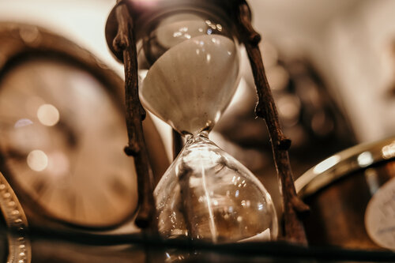

<div class="navbar"><a class="openbtn" onclick="openNav()">&#9776;</a></div>
<main>
⇦ [razafy.com](../../../../index.html)  - [lerina](../../index.html) - [code](../index.html) - [game dev](./index.html)  

# The thrust RPG

## The heart of the game

Given a set of Tasks, 

<div class="image-mosaic">
<div class="card card-tall"><div class="card2"><h3>▲ Without Distraction</h3>
<h3>Beat the time</h3><div class="focus-content">
<p>Build the habit to beat the timer</p>
<ol><li>Pick a Task or step.</li><li>Set the time to beat.</li><li>Finish before the time is up.</li></ol>
</div></div></div>
<div class="card card-tall"><div class="card2"><h3>● Perform the Process</h3>
<h3>Perform Deepwork</h3><div class="focus-content">
<p>Practice Deepwork for long periods.</p>
<p>Start with 20 minutes, then 40, 60, ...</p>
<p>Perform the task. Nothing else matters until the time is up.</p>
</div></div></div>
<div class="card card-tall"><div class="card2"><h3>■ While in Session</h3><h3>Aim for 3 hours sessions</h3>
<div class="focus-content">
<p>Divide the 3 hours into work sessions</p>
<p>Start gradually in 20, 40, 60, 40 , 20 minutes chunks.</p>

</div></div></div>
</div>

This is the core of The personal productivity system called `thrust`

[more about the `thrust` Productivity System](../../text/the_process/thrust_productivity_system.html){target=_blank}

## thrust RPG Gamification

We can use this productivity system to power our RPG game.

## [Purpose](./Purpose.html)

## [Procedure](./Procedure.html)

## [Setup](./Setup.html)

## [Create the adventure premise](./Create_adventure_premise.html)

## [Create a character/alter-ego](./Create_a_character.html)

## [Sketch a story](./Sketch_a_story.html)

## [Build a Mission: Selecting and designing challenges and activities](./Build_a_Mission.md)

## [Progression](./Progression.html)

## [Running the game](./Running_the_game.html)

### Binary (ish) questions

### DOUBLES AND THE TWIST COUNTER

### DETERMINE THE MOOD OF THE NEXT SCENE

When the next scene is not clear, you can start by setting the mood.

```
D6          Next Scene
1-3         Dramatic Scene
4-5         Quite Scene 
6           Meanwhile
```

###  DISTRACTION and DIRECTION

For skills that are not your forté you can roll and add these modifiers

> Even    Distracted, not in charge   
> Odd     Directed focuced, in charge  

## Tips for writing the story arc

The Kishotenketsu (from qichengzhuanhe), a storytelling structure, can actually correspond to the Dan Harmon Story Circle.

Ki (Introduction):
1. You
2. Need

Sho (Development):
3. Go
4. Search

Ten (Twist):
5. Find
6. Take

Ketsu (Conclusion):
7. Return
8. Change

In a story, the following might happen:

    Introduction (ki): an introduction to the characters, era, and other information required to understand the plot.
    Development (shō): follows leads towards the twist in the story. No major changes so far.
    Twist (ten): the story turns toward an unexpected development. This is the crux of the story, the yama (ヤマ) or climax. If the narrative takes several turns, this is the biggest one.
    Conclusion (ketsu), also called ochi (落ち) or ending, wraps up the story.

</main>

⇦ [razafy.com]()  - [lerina]() - [code](../index.html) - [game dev](./index.html)  

<script src="https://razafy.com/js/toc.js"></script>
<script>
let anchor= document.createElement('a');
anchor.href="javascript:closeNav()"; //void(0)"; //anchor[0].onclick = closeNav();
anchor.className = "closebtn";  
anchor.innerHTML="&times;";
document.getElementById("TOC").prepend(anchor);

let navCrumbs= document.createElement('div');
navCrumbs.className = "hover-nav";
navCrumbs.innerHTML = `
<div class="hover-nav">
<ul>
<li><a href="../../../../index.html">⇦ home</a></li>
<li><a href="../../index.html">lerina</a></li>
<li><a href="../index.html">code</a></li>
<li><a href="./index.html">game dev</a></li>
</ul>
</div>`;
document.getElementById("TOC").prepend(navCrumbs); 
</script>
