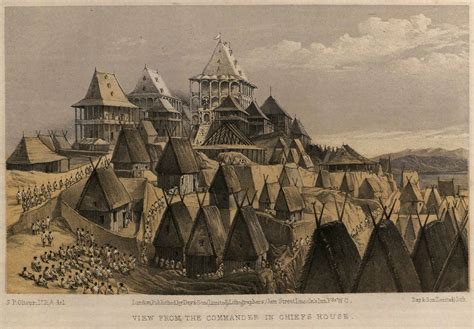
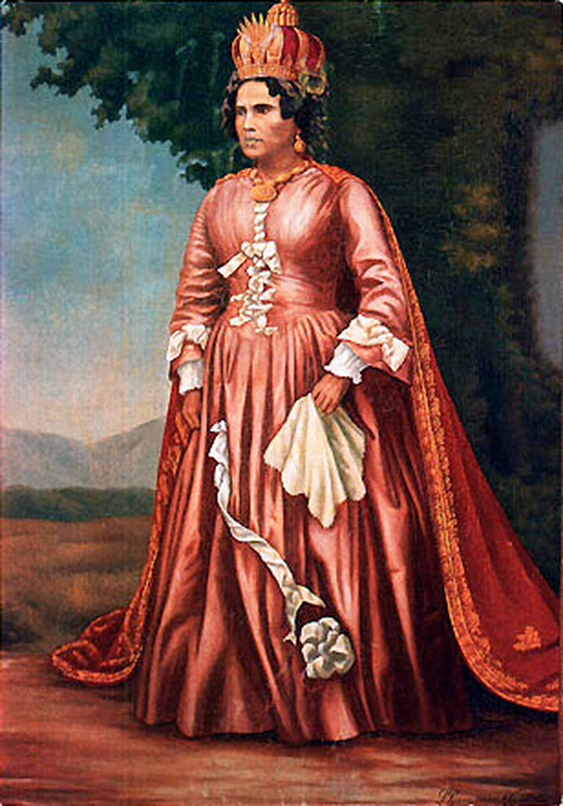
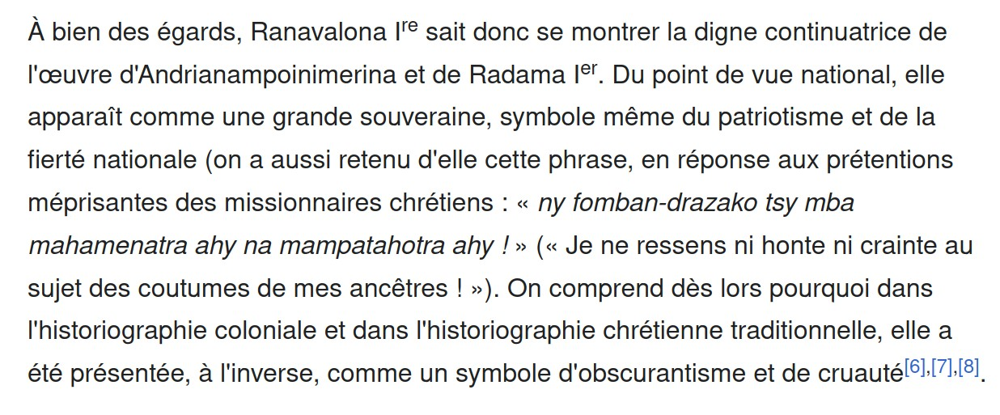
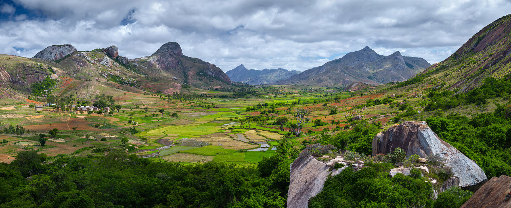

<main>
<header>

</header>

| Any ny vazaha rehetra na Anglisy na Frantsay,
| Antananarivo 26 february 1835

```
For foreiners whether English or French,
Antananarivo 26 February 1835
```

<aside>
<article>
{style="width:400px"}
</article>
</aside>

| Ary lazaiko aminareo havako, fa noho ny soa nataonareo tamin'ny taniko sy ny fanjakako,
| nampianatra fahendrena sy fahalalana, dia misaotra anareo aho amin'izany, fa mamiko sy
| teliko izany.

```
And I tell you my dear friends, because of the good you did to my land and my kingdom,
teaching wisdom and knowledge, I thank you for that, because it is sweet to me and
I appreciate that.
```

| Hitako ny nataonareo tamin-dRadama, ary nony mba amiko tsy manova hianareo, 
| fa manohy izay hahatsara ity tany ity.

```
I saw what you did to Radama, and for me you did not change,
 but continued that which improves this land better.
```

| Ary lazaiko aminareo vazaha rehetra koa fa raha mbola mitoetra eto amin'ny taniko
| hianareo dia mahazo manao izay fomban'drazanareo sy fanaonareo rehetra.

```
And I say to all of you foreiners that as long as you stay in my country
you may practice all your traditions and customs.
```

| Aza manambadipo, fa tsy manova izay fomban-drazanareo sy fanaonareo aho, fa tsara
| ny nataonareo tamin'ny taniko sy ny fankakako;

```
Do not worry, I am not changing your traditions and customs, since
what you have done to my country and my kingdom is good;
```

| nefa kosa na ataoko aza izany, raha ny lalan'ny taniko no dakaina, 
| matiko izay manao izany, na zovy na zovy, nefa tsy eto ihany no tahaka izany, 
| fa na aiza na aiza, maty izay mandika ny lalan'ny tany.

```
however, even though I grant this, if the laws of my country are violated,
I will punish the offenders, no matter who or what, but it's not just here that it is like this,
but wherever one may be, those who transgresses the laws of the country are punished.
```

| Ary tsy izany ihany, fa lazaiko marimarina aminareo koa, fa raha izao vahoakako izao
| manova ny fomban-drazana, izay fanao hatramin'ny Roambinifolo Manjaka ka 
| hatramn'Andrianampoinimerina sy Ilehidama, raha izany no ovana, laviko izany, fa izay
| napetraky ny razako tsy mba mahamenatra ahy na mahatahotra ahy.

```
And not only that, but I also tell you clearly, that if my people
change the tradition, which has been practiced since the Twelve Kingdoms
up to Andrianampoinimerina and Ilehidama, if that is changed, I reject it, 
as what was put in place by my ancestors does not make me ashamed or afraid.
```

| Izay fahedrena sy fahalalana tokony hahasoa ity tany ity, ekeko izany; 
| fa raha ny fomban-drazako kosa no kasikasihina, sasara ny olon-ko hariva ny andro, fa laviko izany.

```
Any wisdom and knowledge that should benefit this country, I accept it;
but if my ancestral customs are touched, I refuse it, "people are tired the time is late".
```

| Koa indro ny amin'ny fivavahana, na Alahady na ankobabandro, ny badisa, ny sosaiety, tsy azon'ny
| vahoakako atao eto amin'ny taniko izany;

```
Also regarding religion, whether on Sunday or weekdays, baptism, the society (LMS), 
my people are forbidden to take part in that in my country;
```

| ary hianareo vazaha kosa, raha mbola misy taozavatra sy fahedrena tokony hahasoa ny ambanilanitra 
| tianareo hampianarina, ataovy fa tsara izany.

```
on the other hand, you foreigners, should there be more skills and wisdom that would 
benefit the ambanilanitra that you would like to teach, do it, that is good.
```

| Izany ary no teniko, ka tiako ho renareo havako.
| 
| Hoy Ranavalomanjaka 

```
Such is my word, and I want you to hear it, my dear friends.

Ranavalomanjaka said
```

---

NOTES:

- *havako* (my relatives) in this context "dear friends"
- *fa mamiko sy teliko izany* (sweet to me and can swallow that)
- *sosaiety* [London_Missionary_Society](https://en.wikipedia.org/wiki/London_Missionary_Society)
- *matiko* literally means "I'll kill you", but in a *parental, authority* context it means "I'll punish you" 
- *sasara ny olon-ko hariva ny andro* (an expression: people are tired, time to go home) this is about over staying your welcome.
- *ambanilanitra* (literally: people under the sun) another name for the People


(Ranavalona - 1861)
<article>
{style="height:23rem"}
</article>


---

<!--
```
>>> 1861-1835
26
>>> 80-26
54
```
-->
</main>
<article>

</article>

