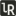
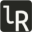

<!-- should be in head 
<link rel="prefetch" href=" http://lerina.github.io/hire_me ">
-->
<canvas id="cnv" width="578" height="150"></canvas>

<nav> 

-   [Home](/)
-   [Learn `Rust` with an RPG Adventure](/rrpg/)
-   [About](/about.html)

</nav>

Learn the Rust Programming Language through a teaching Role Playing Game.

a good foundation for understanding how to get the most out of the Rust language and development ecosystem.    
 `l`ast `R`elease.

#[Learn `Rust` with an RPG Adventure](/rrpg/)

[Learn `Rust` with an RPG Adventure](/rrpg/)

[JS Game programming tutorial](https://whispering-cove-41710.herokuapp.com/)

<nav>

-  Helpful Links

        - Rust
        - The [Rust] Book

- Getting Started with WebAssembly (WASM) with Rust

- &nbsp; Rustacean Order: Contributing to the Rust Community

</nav>

<footer style="clear:both">

-   [zoom]()
-   [email](mailto:lerina.razafy@gmail.com)
-   [github.com/lerina](https://github.com/lerina)

<em>&#xa9;</em> 2018  &nbsp; <a href="http://razafy.com" target="_blank"> lerina  ^_^ </a>

</footer>

