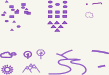

<link href="https://fonts.googleapis.com/css?family=Architects+Daughter|Inconsolata&display=swap" rel="stylesheet"> 
<!-- img id="topPix" src="./pix/lRustRPG.jpg" / -->
<section class="sponsors">

</section><!-- sponsors -->

<header class="main-header clearfix">

# Solution Developer & Software Writer

<nav class="main-menu">
<ul>
<li class="main-menu__item">Home</li>
<li class="main-menu__item">[About](/about.html)</li>
</ul>
</nav><!-- nav -->
</header><!-- header -->

<section class="sponsors-wrapper clearfix">
<main class="content-area">

`Software Development` happens way before any line of code is hatched.
Whether one is a software engineer, a web developer or an old school hacker the core principles remains the same;

- Clarity and Understanding through openness and adventure.
- Creativity in Coding      through concise explicitness and structure. 
- Agency by Delivery        through swiftness and collaborative infrastructure. 

</main>

<section class="sponsors">

### Solution Development

Domain knownledge and Problem solving and solution modeling comes first.  

**Clarity and Understanding**

Keeping your mind open and daring to venture outside of the beaten path

adventure.
Notes, prose and poems accumulated through out the years

- All notes in clean form

- Feature {Pain-Gain, Deam_it, Fear_it}

Acquiring the tools and knowledge to figure out domain knowledge rapidly

#### This is the INPUT Stage

### Software Design

In fact it comes way before Software Design and trial Spikes show up on the horizon.   

**Creativity in Coding**

This section is about Writing Software. 
You will find Writings about the Charge and Craft of Software production.
And tips, tutorials, and code along lessons.

- Prog as a story

- Narration as a teaching tool in programming

- current interests {rust, wasm, Js, Py, Dj} 

Methodology

> Code Step through

> Code Walk through

> Speed Coding (Sorted Examples & Exercise Drills)

#### This is the Processing Stage

### Software Writing - _Coding_

Code implementation is interlaced between alternating cycles 
of Solution Development and Software Design.  

**Agency by Delivery**

Agency is about POWER

P. Purpose      &    Principles  
O. Organization &    Opportunity  
W. Willingness  &    Wit  
E. Efficiency   &    Execution   
R. Resolve      &    Resources   

As a technical solution emerges, 

#### This is the OUTPUT Stage

<a href="./prog/">...More</a>

</section><!-- sponsors -->
</section><!-- sponsors-wrapper -->

<!-- container -->

<footer class="footer">

-   [zoom]()
-   [email](mailto:learningrustrpg@gmail.com)
-   [github.com/lerina](https://github.com/lerina)

<em>&#xa9;</em> 2019  &nbsp; <a href="http://razafy.com" target="_blank"> lerina  ^_^ </a>

</footer><!-- footer -->

