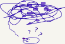
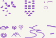

<link href="https://fonts.googleapis.com/css?family=Architects+Daughter|Inconsolata&display=swap" rel="stylesheet"> 
<!-- img id="topPix" src="./pix/lRustRPG.jpg" / -->
<section class="sponsors">

</section><!-- sponsors -->

<header class="main-header clearfix">

# Solution Developer & Software Writer

<nav class="main-menu">
<ul>
<li class="main-menu__item">Home</li>
<li class="main-menu__item">[About](/about.html)</li>
</ul>
</nav><!-- nav -->
</header><!-- header -->

<section class="sponsors-wrapper clearfix">
<main class="content-area">

# Coming Soon
## Under Construction
### ETA: September 2019

</main>

<section class="sponsors">

### Non-Tech Texts, Ideas and Concept

"I am the maker of my     `PEACE`  
 I have dominion over my  `Passions`  
 I am the tutor of my     `Emotions`  
 I am the deflator of my  `Anger`  
 I am the moderator of my `Cravings`  
 I am the regulator of my `Energy` "  
                                                    _ lerina  

<quoteblock>
hh
        bbb
        ccc

</quoteblock>

If you enjoy word play and constrained metaphors, there are more
in this section

---

Bearing in mind that:

"Ideas are like, not the work!"  
    _ Cameron Howe : halt and catch fire, s4e9  

you may wish to proceed to the next section.

### Tech Contepts Lab

To really understand something, one first learn the rules and become good at it.
To master something, one needs to experiment with the constraints, twist, bend 
and sometimes break the rules. 

The Tech Concept Lab is such a place.

Going against the general concensus and status quo on select Computer Science,
Software Enginering, Software Development habits, processes and cult like practices.

TDD, BDD, the noise has reached cult-like levels. 
So here is my contribution, when you code, I urge you to let SECT prevail.

- `S`tory Driven Requirements
- `E`xample Driven Design
- `C`ode Driven Development
- `T`est Driven Delivery

And by all mean, push for 100% test coverage, of that portion of code 
that matters.

---

Not every progress is about rebelion. I don't seek controversy. 
I just optimize for efficiency.

"From spaghetti code to ravioli code:   
 self-contained modules with value inside"  
                                 __ lerina  

Here is how I earn my `dough`. Its all about PASTA.

- `P`ractice  
- `A`dapt (for your constraints)  
- `S`tudy (senior's code)  
- `T`week (optimize)  
- `A`buse (push it to the limit)  

> Code as a Narrative

<a href="./prog/">...More</a>

### Code Walkthrough and Tutorials

- Tutorials
- Practice SPEED (Sorted Programming Examples and Exercise Drills)

</section><!-- sponsors -->
</section><!-- sponsors-wrapper -->

<section class="sponsors-wrapper clearfix">
<section class="sponsors">

 
# the Rust Programming Game

> ETA: Spring Break 2020

 Its a Story, a RPG Narrative

 Its a Guide, a Rust programming Tutorial

 Its a Fun, a Live Coding Role Playing Game

</section><!-- sponsors -->
</section><!-- sponsors-wrapper -->

<!-- container -->

<footer class="footer">

-   [zoom]()
-   [email](mailto:learningrustrpg@gmail.com)
-   [github.com/lerina](https://github.com/lerina)

<em>&#xa9;</em> 2019  &nbsp; <a href="http://razafy.com" target="_blank"> lerina  ^_^ </a>

</footer><!-- footer -->

