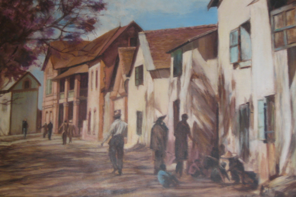
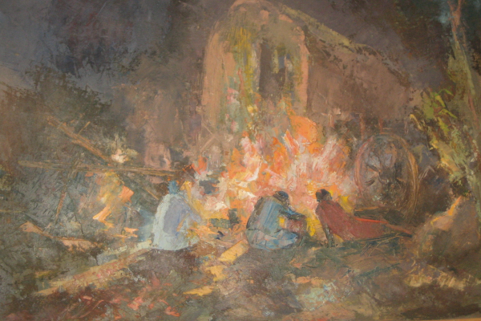

<main>

Tonga soa. Welcome Friend  `OPTIMAL`{.small_fancySerif} part of `IMPACT Web Agency`{.small_fancySerif}
leads the way to bring secure and fast app development in the Indian Ocean Neighbourhood.

 
<section id="featured_projects">

The following are selected tutorial we developed to bridge the gap between the beginner that has finished the official Rust book and shift into *Rustaceans* status with intermediate skills.

We select our collaborators from a pool of experienced developers and designers that have 
successfully attended our Rust Programming workshops.

## Featured tutorials

There is a cure  for insecure  code

<!--^-- mosaic-hover-menu -->

<a href="./html/code/rust-wasm/index.html">
Learn  Rust-Wasm & Webassembly
</a>

<a href="./html/code/coding_math/index.html">
Coding Math
</a>

<!--

<a href="./html/lrn/text/index.html">
Dev Notes
</a>

<a href="./html/code/game_dev/index.html">
Game Dev
</a>

-->

<a href="./html/nosy_malagasy/index.html">
Discover Nosy Malagasy
</a>

<!--

<a href="./html/lrn/beloha/index.html">
Beloha: a webnovel
</a>

-->

<!--^-- image-mosaic -->
</section> <!-- ^-- featured_projects -->

Our Services

<section class="hero">
<article>

<h3>Design & develop</h3>

Secure Web Agency

<a href="./html/lrn/index.html" class="btn">more...</a>

</article>
<article>

<h3>Code Workshop</h3>

Dates for the Next sessions

<a href="#" class="btn">more...</a>

</article>
<article>

<h3>Rent our Venue</h3>

for your talk or coaching

<a href="#" class="btn">more...</a>

</article>
</section> <!-- ^--- hero -->

<footer>

 

Lerina RAZAFY  
Secure Code Practician 

<!-- >
  <ul>
    <h3 class="pink">Header</h3>
    <li>Some Link</li>
    <li>Some Link</li>
    <li>Some Link</li>
    <li>Some Link</li>
    <li>Some Link</li>
    <li>Some Link</li>
  </ul>
  <ul>
    <h3 class="red">Header</h3>
    <li>Some Link</li>
    <li>Some Link</li>
    <li>Some Link</li>
    <li>Some Link</li>
    <li>Some Link</li>
    <li>Some Link</li>
  </ul>
  <ul>
    <h3 class="orange">Header</h3>
    <li>Some Link</li>
    <li>Some Link</li>
    <li>Some Link</li>
    <li>Some Link</li>
    <li>Some Link</li>
    <li>Some Link</li>
  </ul>
  <ul>
    <h3 class="green">Header</h3>
    <li>Some Link</li>
    <li>Some Link</li>
    <li>Some Link</li>
    <li>Some Link</li>
    <li>Some Link</li>
    <li>Some Link</li>
  </ul>
-->
</footer>

</main>
