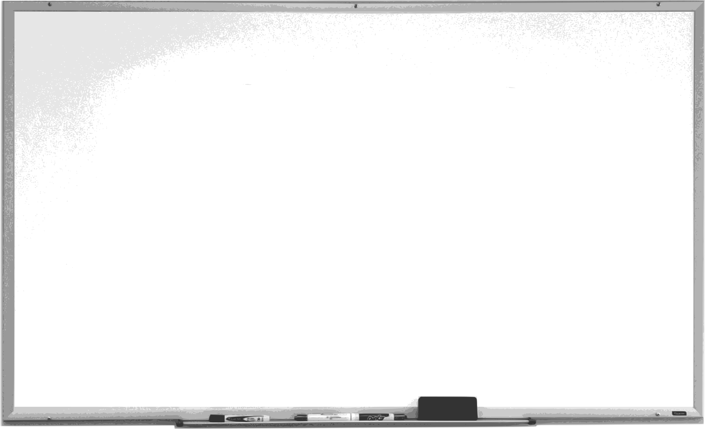

<header class="main-header clearfix">

<nav class="main-menu">
<ul>
<li class="main-menu__item">[Home](/)</li>
<li class="main-menu__item">[Selected writings](/writings/)</li>
<li class="main-menu__item">Programming</li>
<li class="main-menu__item">[About](/about.html)</li>
</ul>
</nav><!-- nav -->
</header><!-- header -->

<section class="sponsors-wrapper clearfix">
<main class="content-area">

<section class="sponsors">

<h2 id="Rust_prog">Rust</h2>

-    The Challenge. This defines "where we are now" and is always either a problem or an opportunity.
-    The Undesired Outcome. This defines "where we don't want to be"--what will happen if the problem or opportunity is not addressed.
-    The Desired Outcome. This defines "where we do want to be," which should obviously be better than the undesired outcome.
-    The Proposed Solution. This defines what must be done to avoid the undesired outcome and achieve the desired one.
-    The Risk Remover. Why the proposed solution is likely to succeed and unlikely to fail.
-    The Call to Action. The decision you want made that will put the solution into motion to achieve the desired outcome.

<a href="./rust_000.html"> A quick tour of Rust for programmers</a>

</section>

<section class="sponsors">

<h2 id="Js-Py_ffi">Boost JavaScript &amp; Python</h2>

-    The Challenge. This defines "where we are now" and is always either a problem or an opportunity.
-    The Undesired Outcome. This defines "where we don't want to be"--what will happen if the problem or opportunity is not addressed.
-    The Desired Outcome. This defines "where we do want to be," which should obviously be better than the undesired outcome.
-    The Proposed Solution. This defines what must be done to avoid the undesired outcome and achieve the desired one.
-    The Risk Remover. Why the proposed solution is likely to succeed and unlikely to fail.
-    The Call to Action. The decision you want made that will put the solution into motion to achieve the desired outcome.

<a href="./ffi.html"> more ...</a>

</section>

<section class="sponsors">

<h2 id="wasm_prog">Rust and Webassembly</h2>

-    The Challenge. This defines "where we are now" and is always either a problem or an opportunity.
-    The Undesired Outcome. This defines "where we don't want to be"--what will happen if the problem or opportunity is not addressed.
-    The Desired Outcome. This defines "where we do want to be," which should obviously be better than the undesired outcome.
-    The Proposed Solution. This defines what must be done to avoid the undesired outcome and achieve the desired one.
-    The Risk Remover. Why the proposed solution is likely to succeed and unlikely to fail.
-    The Call to Action. The decision you want made that will put the solution into motion to achieve the desired outcome.

<a href="./wasm.html"> more ...</a>

</section>

## Other selected programming texts

<h3 id="prog_txt">TOC</h3>

- [Quick Rust Overview](./rust_000.html)
- [Rust and FFI](./ffi.html)
- [The SECT Trick](./sect.html)
- [Webassembly](wasm.html)

</main>
</section><!-- sponsors-wrapper -->

<!-- container -->

<footer class="footer">

-   [zoom]()
-   [email](mailto:learningrustrpg@gmail.com)
-   [github.com/lerina](https://github.com/lerina)

<em>&#xa9;</em> 2019  &nbsp; <a href="http://razafy.com" target="_blank"> lerina  ^_^ </a>

</footer><!-- footer -->

